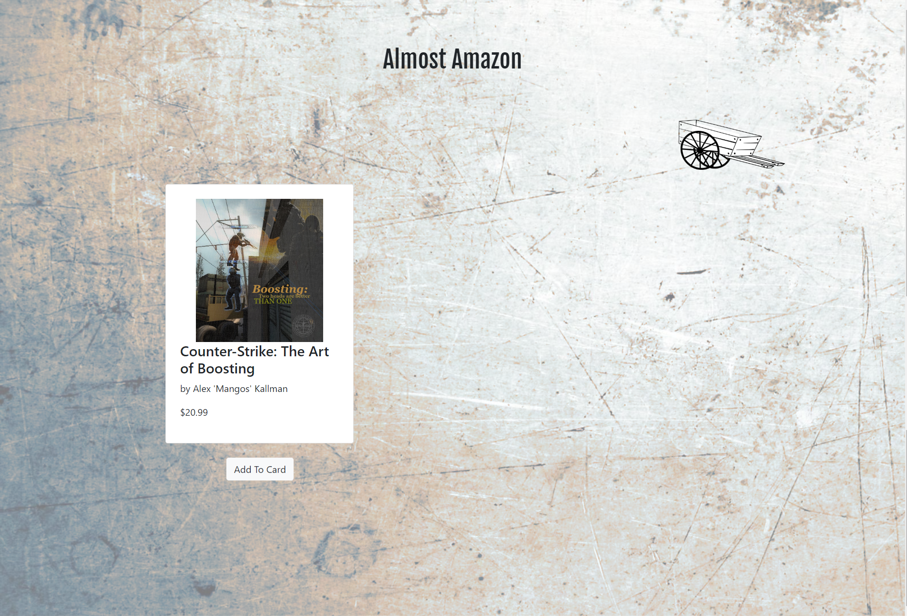
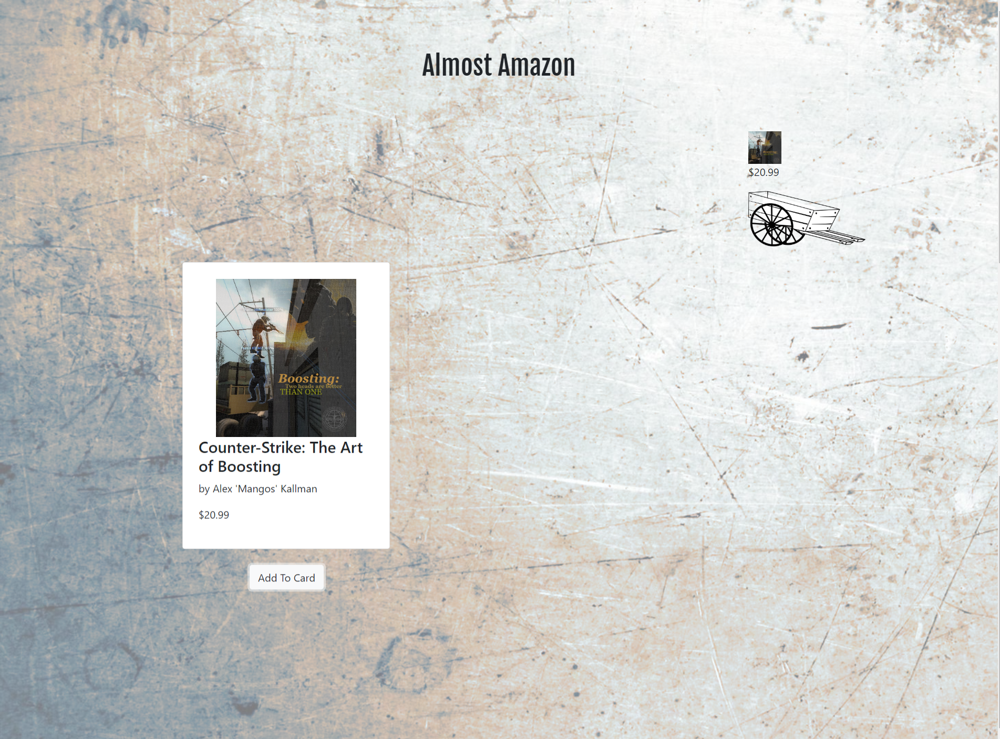

# Almost Amazon
Almost Amazon was another project that was to practice modules and the correct way to import and export said modules. AA also uses event listeners and return methods to make the cart work. I also played around and used more bootstrap, which was interesting. Below you can see there are two screenshots, one that the user will see when they visit the page, and after the add book button has been clicked (also verifying that this page does in fact work).

## Screenshot - Start Page


## Screenshot - Cart Full


## How to run this project
* Use npm to install http-server in your terminal:
```sh
npm install -g http-server
```
* Run the server:
```sh
hs -p 9999
```
* Open Chrome and navigate to 
```
localhost:9999
```
